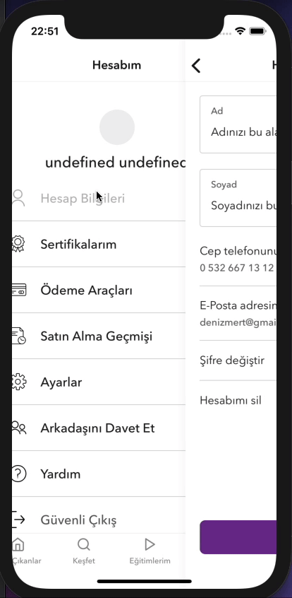
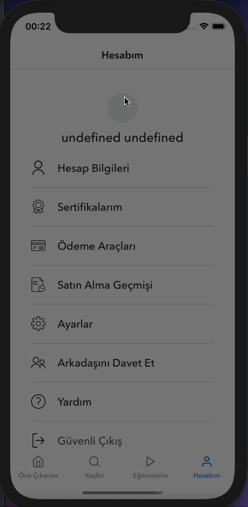
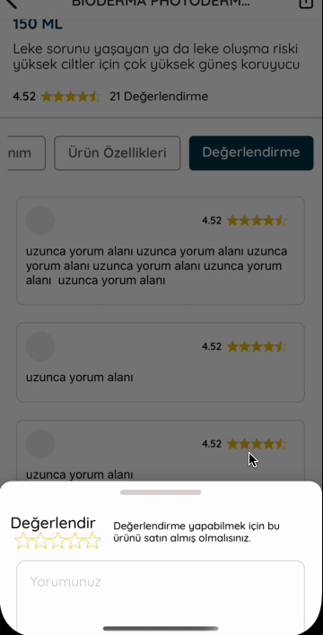
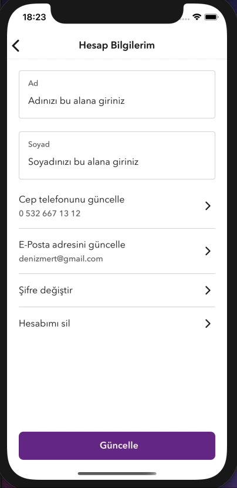
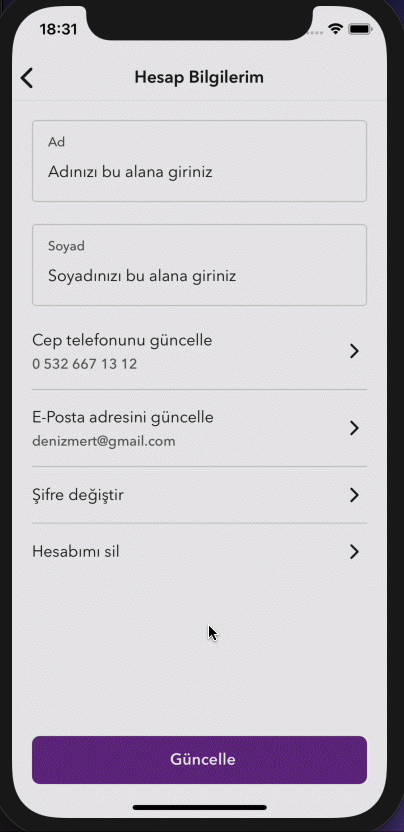
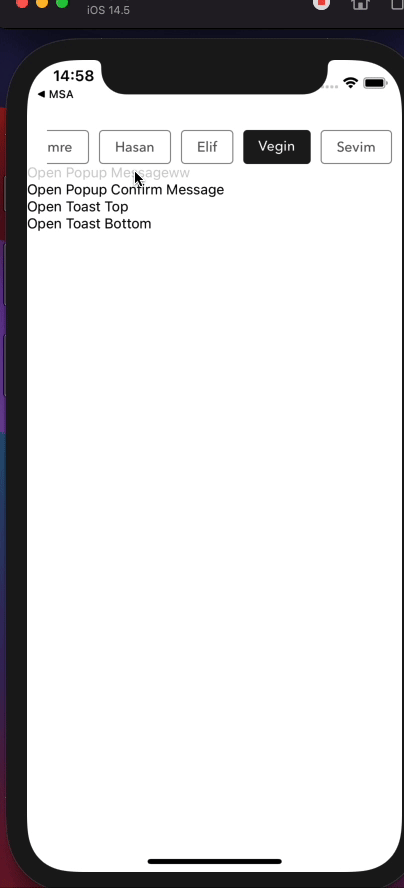
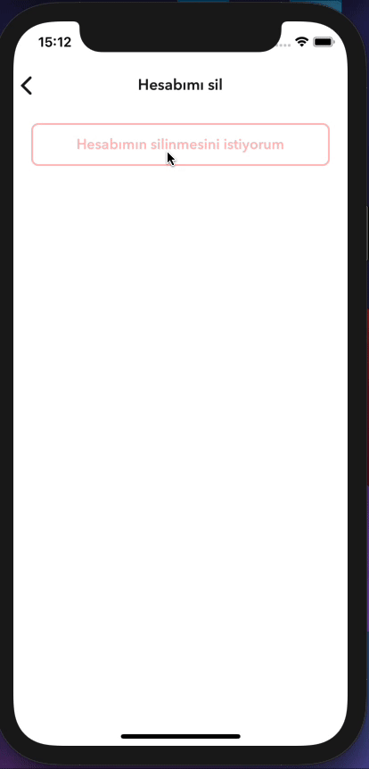
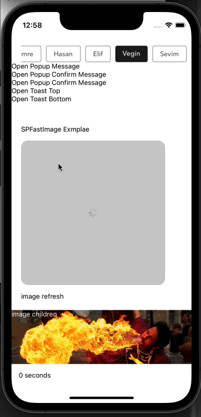
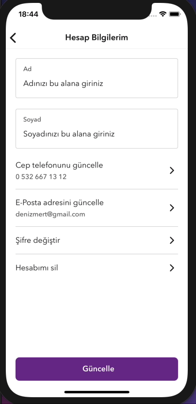

[](https://www.npmjs.com/package/@sekizlipenguen/react-native-popup-confirm-toast)
[](https://www.npmjs.com/package/@sekizlipenguen/react-native-popup-confirm-toast)
[](https://github.com/sekizlipenguen/react-native-popup-confirm-toast/issues)
[](https://github.com/sekizlipenguen/react-native-popup-confirm-toast/issues?q=is%3Aissue+is%3Aclosed)

# @sekizlipenguen/react-native-popup-confirm-toast

A flexible and user-friendly popup, toast, and bottom sheet solution for React Native. This package provides customizable components for displaying interactive messages, confirmation dialogs, and toast notifications in your mobile applications.

**Note:** This package has been moved to the `@sekizlipenguen` scope for improved organization and better support for future updates.

## Example Bottom Sheet

|    Custom Example 1    |    Custom Example 2    |    Custom Example 3    |    Custom Example 4    |
|:----------------------:|:----------------------:|:----------------------:|:----------------------:|
|  |  |  |  |

## Example Popup Message

|    Example Message     | Example Confirm Message | Example Message AutoClose | Example Custom Body Component |
|:----------------------:|:-----------------------:|:-------------------------:|:-----------------------------:|
|  |   |     |         |

## Example Toast Message

| Example Toast Top | Example Toast Bottom |
|:-----------------:|:--------------------:|
|  |     |

## Usage

## Installation

```
yarn add @sekizlipenguen/react-native-popup-confirm-toast
or
npm install @sekizlipenguen/react-native-popup-confirm-toast
```

## Usage

Wrap your root component in Provider from @sekizlipenguen/react-native-popup-confirm-toast. If you have a vanilla React Native project,
it's a good idea to add it in the component which is passed to AppRegistry.registerComponent. This will usually be in
the index.js file. If you have an Expo project, you can do this inside the exported component in the App.js file.

### Example Provider

```
import * as React from 'react';
import { AppRegistry } from 'react-native';
import {Root as PopupRootProvider} from '@sekizlipenguen/react-native-popup-confirm-toast';
import { name as appName } from './app.json';
import App from './src/App';

export default function Main() {
  return (
    <PopupRootProvider>
      <App />
    </PopupRootProvider>
  );
}

AppRegistry.registerComponent(appName, () => Main);
```

### Example Bottom Sheet

```
import { Root, SPSheet } from '@sekizlipenguen/react-native-popup-confirm-toast'

const component = (props) => {
    //hook or class 
    return (<Text>Hi, SekizliPenguen</Text>);
    
    //props.spSheet.hide();
    //props.spSheet.setHeight(150,()=>alert('nice'));
};

<View>
    <TouchableOpacity
        onPress={() => {
            const spSheet = SPSheet;
            spSheet.show({
                component: () => component({...this.props, spSheet}),
                dragFromTopOnly: true,
                onCloseComplete: () => {
                    alert('onCloseComplete');
                },
                onOpenComplete: () => {
                    alert('onOpenComplete');
                },
                height:260
            });
        }
    >
        <Text>Open SPSheet Message</Text>
    </TouchableOpacity>
</View>
```

### Example Message

```
import {Popup} from '@sekizlipenguen/react-native-popup-confirm-toast'
<View>
    <TouchableOpacity
        onPress={() =>
          Popup.show({
            type: 'success',
            title: 'Success!',
            textBody: 'Mutlak özgürlük, kendi başına hiçbir anlam ifade etmez. ',
            buttonText: 'OK',
            callback: () => Popup.hide()
          })
        }
    >
        <Text>Open Popup Message</Text>
    </TouchableOpacity>
</View>
```

### Example Confirm Message

```
import {Popup} from '@sekizlipenguen/react-native-popup-confirm-toast'
<View>
    <TouchableOpacity
        onPress={() =>
            Popup.show({
                type: 'confirm',
                title: 'Dikkat!',
                textBody: 'Mutlak özgürlük, kendi başına hiçbir anlam ifade etmez. ',
                buttonText: 'Tamam',
                confirmText: 'Vazgeç',
                callback: () => {
                    alert('Okey Callback && hidden');
                    Popup.hide();
                },
                cancelCallback: () => {
                    alert('Cancel Callback && hidden');
                    Popup.hide();
                },
            })
        }
    >
        <Text>Open Popup Confirm Message</Text>
    </TouchableOpacity>
</View>
```

### Example Custom Body Component

```
import { Root, Popup } from '@sekizlipenguen/react-native-popup-confirm-toast'
//hooks or class component
const bodyComponent = ({props,bodyProps}) => {
    return (
        <View onLayout={(e}=>bodyProps.onLayout(e)}>
        <Text>Mustafa Kemal ATATÜRK</Text>
        </View>
    );
}

<Root>
    <View>
        <TouchableOpacity
            onPress={() => {
                const popup = Popup;
                popup.show({
                    type: 'confirm',
                    textBody: 'Hesabınızın silinme işlemini onaylamak için şifrenizi giriniz.',
                    bodyComponent: (bodyProps) => bodyComponent({...props,bodyProps,popup}),
                    confirmText: 'Cancel',
                    iconEnabled: false,
                    buttonEnabled: false,
                });
            }}
        >
            <Text>Open Popup Confirm Message</Text>
        </TouchableOpacity>
    </View>
</Root>
```

### Toast

```
import { Root, Toast } from '@sekizlipenguen/react-native-popup-confirm-toast'
    <Root>
        <View>
            <TouchableOpacity
                onPress={() => 
                      Toast.show({
                          title: 'I\'m Eight!',
                          text: 'The best gift I received in this life are the codes. They are worlds inside the worlds.',
                          backgroundColor: '#702c91',
                          timeColor: '#440f5f',
                          timing: 3000,
                          icon: <Icon name={'check'} color={'#fff'} size={31}/>,
                          position: 'bottom',
                          statusBarType:'dark-content',
                          onCloseComplete: () => {
                            alert('onCloseComplete');
                          },
                          onOpenComplete: () => {
                            alert('onOpenComplete');
                          },
                        })
                }
            >
                <Text>Open Bottom Toast</Text>
            </TouchableOpacity>
            
            <TouchableOpacity
                onPress={() => 
                    Toast.show({
                      title: 'I\'m Eight!',
                      text: 'The best gift I received in this life are the codes. They are worlds inside the worlds.',
                      backgroundColor: '#702c91',
                      timeColor: '#440f5f',
                      timing: 3000,
                      icon: <Icon name={'check'} color={'#fff'} size={31}/>,
                      position: 'top',
                      statusBarTranslucent: false,
                      statusBarType:'light-content',
                      onCloseComplete: () => {
                        alert('onCloseComplete');
                      },
                      onOpenComplete: () => {
                        alert('onOpenComplete');
                      },
                    })
                }
            >
                <Text>Open Top Toast</Text>
            </TouchableOpacity>

        </View>
    </Root>
```

## Features & Documentation

### SPSheet

| Key                        | Type                     | Description                                                               | Default            |
|----------------------------|--------------------------|---------------------------------------------------------------------------|--------------------|
| `background`               | string                   |                                                                           | rgba(0, 0, 0, 0.5) |
| `height`                   | number                   | auto height (min: 250)                                                    | 250                |
| `duration`                 | number                   | animation time used when opening                                          | 250(ms)            |
| `closeDuration`            | number                   | animation time used when closing                                          | 300(ms)            |
| `closeOnDragDown`          | boolean                  | Use drag with motion to close the window                                  | true               |
| `closeOnPressMask`         | boolean                  | press the outside space to close the window                               | true               |
| `closeOnPressBack`         | boolean                  | Press the back key to close the window (Android only)                     | true               |
| `dragTopOnly`              | boolean                  | use only the top area of the draggable icon to close the window           | false              |
| `component`                | component(hook or class) | custom modal component container                                          | null               | 
| `onOpen`                   | function                 | works after the window is opened                                          | null               |
| `onOpenComplete`           | function                 | works after the window is opened                                          | null               |
| `onClose`                  | function                 | works after window is closed                                              | null               |
| `onCloseComplete`          | function                 | works after window is closed                                              | null               |
| `customStyles`             | object                   | customStyles: { draggableIcon: {}, container: {}, draggableContainer:{} } | {}                 |
| `timing`                   | number                   | Use this parameter for automatic shutdown.                                | 0(ms)              |
| `keyboardHeightAdjustment` | boolean                  | re-adjusts the height when the keyboard is opened                         | false              |

### Popup

| Key                      | Type                               | Description                                                                                        | Default                                                                                                                   |
|--------------------------|------------------------------------|----------------------------------------------------------------------------------------------------|---------------------------------------------------------------------------------------------------------------------------|
| `title`                  | string                             |                                                                                                    | false                                                                                                                     |
| `textBody`               | string                             |                                                                                                    | false                                                                                                                     | 
| `bodyComponent`          | component(hook or class)           | custom modal component container                                                                   | null                                                                                                                      | 
| `bodyComponentForce`     | boolean                            | The component you specify covers the entire space                                                  | false                                                                                                                     | 
| `onLayout`               | (event: LayoutChangeEvent) => void | Triggers automatically to calculate and adjust the height of the popup component during rendering. | -                                                                                                                         |
| `type`                   | enum                               | enum(success, info, danger, warning, confirm)                                                      | warning                                                                                                                   |
| `buttonText`             | string                             |                                                                                                    | Ok                                                                                                                        |
| `confirmText`            | string                             |                                                                                                    | Cancel                                                                                                                    |
| `callback`               | function                           | ok button press                                                                                    | popupHidden                                                                                                               |
| `cancelCallback`         | function                           | cancel button press                                                                                | popupHidden                                                                                                               |
| `background`             | string                             |                                                                                                    | rgba(0, 0, 0, 0.5)                                                                                                        |
| `timing`                 | number                             | 0 > autoClose                                                                                      | 0                                                                                                                         |
| `iconEnabled`            | boolean                            |                                                                                                    | true <br/>                                                                                                                |
| `iconHeaderStyle`        | object                             |                                                                                                    | {height: 75, width: 100, backgroundColor: '#fff'}                                                                         |
| `icon`                   | requireUrl                         |                                                                                                    | require('../assets/{type}.png')                                                                                           |
| `containerStyle`         | object                             |                                                                                                    | { position: 'absolute', zIndex: 10, backgroundColor: 'rgba(0, 0, 0, 0.5)', alignItems: 'center', top: 0, left: 0,}        |
| `modalContainerStyle`    | object                             |                                                                                                    | { width: '90%',backgroundColor: '#fff', borderRadius: 8, alignItems: 'center', overflow: 'hidden', position: 'absolute'}} |
| `buttonContentStyle`     | object                             |                                                                                                    | {}                                                                                                                        |
| `okButtonStyle`          | object                             |                                                                                                    | {backgroundColor: '#702c91'}                                                                                              |
| `confirmButtonStyle`     | object                             |                                                                                                    | default                                                                                                                   |
| `okButtonTextStyle`      | object                             |                                                                                                    | default                                                                                                                   |
| `confirmButtonTextStyle` | object                             |                                                                                                    | default                                                                                                                   |
| `titleTextStyle`         | object                             |                                                                                                    | default                                                                                                                   |
| `descTextStyle`          | object                             |                                                                                                    | default                                                                                                                   |
| `bounciness`             | number                             |                                                                                                    | 15                                                                                                                        |
| `onClose`                | function                           | when the popup is first closed                                                                     | false                                                                                                                     |
| `onCloseComplete`        | function                           |                                                                                                    | false                                                                                                                     |
| `onOpen`                 | function                           | when the popup is first opened                                                                     | false                                                                                                                     |
| `onOpenComplete`         | function                           |                                                                                                    | false                                                                                                                     |
| `duration`               | boolean                            |                                                                                                    | 100                                                                                                                       |
| `closeDuration`          | boolean                            |                                                                                                    | 100                                                                                                                       |

### Toast

| Key                      | Type      | Description                                       | Default                                                       |
|--------------------------|-----------|---------------------------------------------------|---------------------------------------------------------------|
| `title`                  | string    |                                                   | false                                                         |
| `text`                   | string    | Description                                       | false                                                         |
| `titleTextStyle`         | object    |                                                   | {color: '#fff',fontWeight: 'bold',fontSize: 16}               |
| `descTextStyle`          | object    |                                                   | {marginTop: 5,fontSize: 13,color: '#fff', fontWeight: '400',} |
| `backgroundColor`        | string    |                                                   | #1da1f2                                                       |
| `timeColor`              | string    | time backgroundColor                              | #1c6896                                                       |
| `position`               | enum      | parameters => top, bottom                         | bottom                                                        |
| `icon`                   | component | (react-native-vector-icons or <Image/> component) | null                                                          |
| `timing`                 | number    |                                                   | 5000 ms                                                       |
| `statusBarType`          | string    |                                                   | default                                                       |
| `statusBarTranslucent`   | boolean   |                                                   | false                                                         |
| `statusBarHidden`        | boolean   |                                                   | false                                                         |
| `statusBarAndroidHidden` | boolean   |                                                   | true                                                          |
| `statusBarAppleHidden`   | boolean   |                                                   | false                                                         |
| `hiddenDuration`         | number    |                                                   | 200 ms                                                        |
| `startDuration`          | number    |                                                   | 200 ms                                                        |
| `onOpen`                 | function  | works after the window is opened                  | null                                                          |
| `onOpenComplete`         | function  | works after the window is opened                  | null                                                          |
| `onClose`                | function  | works after window is closed                      | null                                                          |
| `onCloseComplete`        | function  | works after window is closed                      | null                                                          |

### Methods

| Component Name | Method Name | Example                                                                | Description                         |
|----------------|-------------|------------------------------------------------------------------------|-------------------------------------|
| SPSheet        | show        | const spSheet = SPSheet; spSheet.show(config);                         |                                     |
| SPSheet        | hide        | const spSheet = SPSheet; spSheet.hide();                               |                                     |
| SPSheet        | setHeight   | const spSheet = SPSheet; spSheet.setHeight(500,completeEventFunction); | allows you to change the box height |
| Popup          | show        | const popup = Popup; popup.show(config);                               |                                     |
| Popup          | hide        | const popup = Popup; popup.hide();                                     |                                     |
| Toast          | show        | const toast = Toast; toast.show(config);                               |                                     |
| Toast          | hide        | const toast = Toast; toast.hide();                                     |                                     |

### Helper Function

```
    import {getStatusBarHeight} from '@sekizlipenguen/react-native-popup-confirm-toast';
```

## Author

SekizliPenguen

## License

[MIT](./LICENSE)
